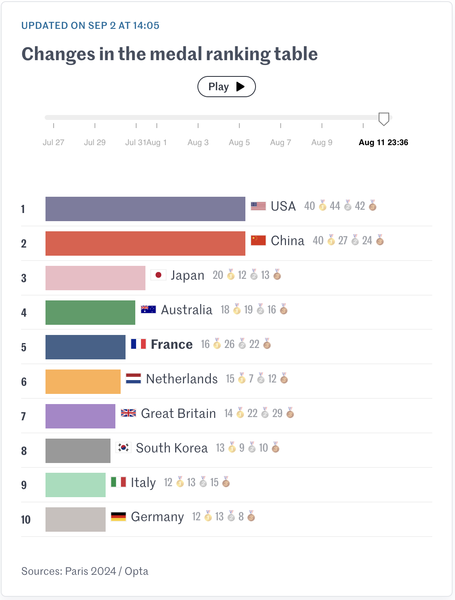
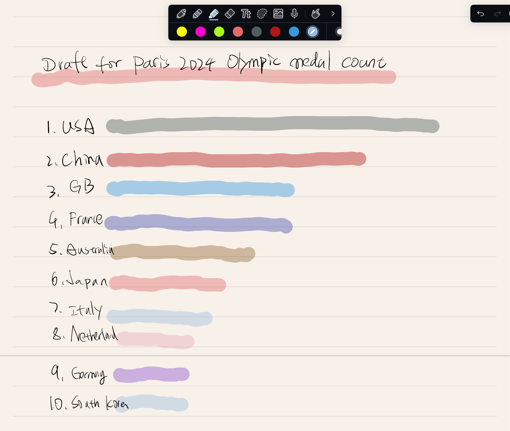
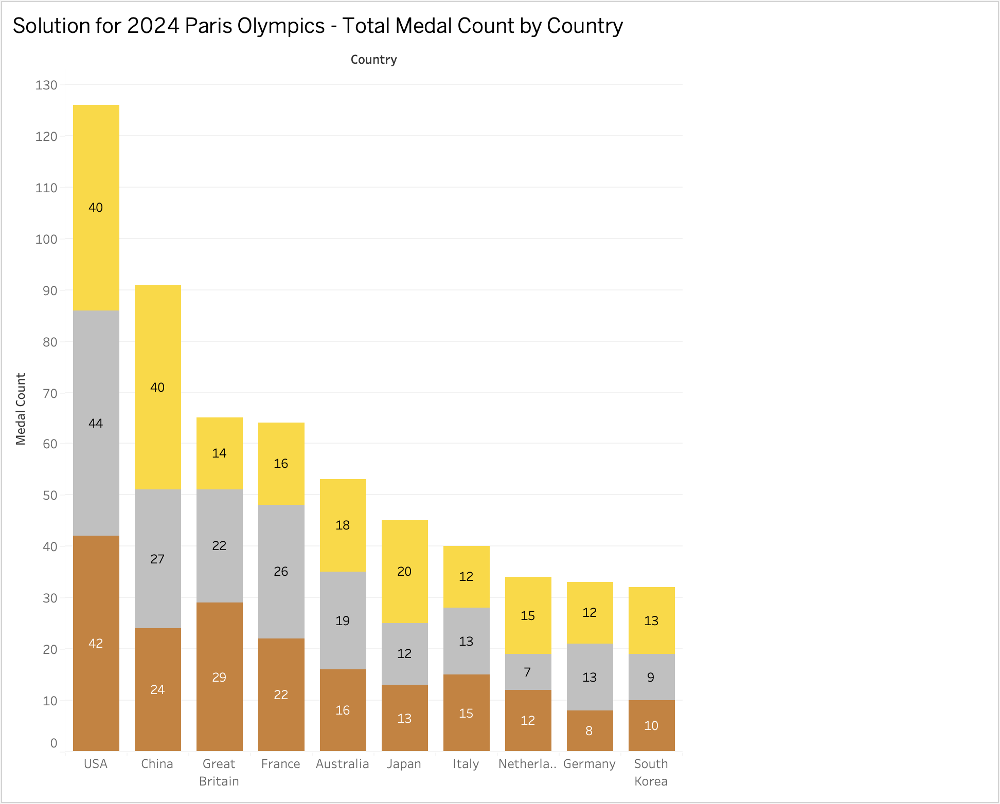

# Assignment 3 & 4: Critique by Design with Tableau (MakeoverMonday)

## Overview

This project focuses on redesigning a data visualization of the **2024 Paris Olympic Medal Count**. The original visualization, available on [Le Monde](https://www.lemonde.fr/en/les-decodeurs/article/2024/08/07/paris-2024-olympics-how-the-medal-table-has-evolved-since-the-start-of-the-games_6711001_8.html), primarily emphasized gold medals, while silver and bronze were considered only for ties. My goal was to create a more balanced and comprehensive visualization that presents the **total number of medals** (gold, silver, and bronze) for the top 10 countries in the 2024 Paris Olympics.

## Step-by-Step Process

### 1. Original Visualization

The original data visualization on [Le Monde](https://www.lemonde.fr/en/les-decodeurs/article/2024/08/07/paris-2024-olympics-how-the-medal-table-has-evolved-since-the-start-of-the-games_6711001_8.html) focused primarily on the **gold medal count** for each country and showed the evolution of medal standings throughout the Olympics. While this provided useful insight into the standings based on gold medals, it did not offer a complete view of each country's overall medal performance. To improve this, I decided to redesign the visualization by including the **total medals** (gold, silver, and bronze) to better communicate each country's overall success.

- **Original Visulization Screenshot**: 

---

### 2. Sketching the Draft

I began the redesign by sketching out a **pen-and-pencil draft** that focused on displaying the total medal count for each country using a stacked bar chart. Each segment of the bar was color-coded to represent gold, silver, and bronze medals. This draft did not include exact numbers for the medals; it was designed to show the structure and flow of the data in a simplified way.

- **Draft Screenshot**: 

---

### 3. User Feedback (Step 4: Test the Solution)

I shared my draft with two different individuals to gather feedback. Here are the key insights from their responses:

#### **Participant 1**
- **General understanding**: They understood it was a medal count but found it difficult to interpret without exact numbers.
- **Suggestions**: Add exact medal counts on the bars and sort the countries by total medal count.

#### **Participant 2**
- **General understanding**: They recognized the general concept of the medal count but also noted the lack of clarity due to missing labels.
- **Suggestions**: Include medal counts directly on the bars to enhance clarity and comparison.

---

### 4. Redesign in Tableau

Based on the feedback, I made several improvements to the final design:

1. **Added Labels**: I included the **medal count** for gold, silver, and bronze on each bar to make it easier to interpret the data.
2. **Sorted by Total Medals**: The countries are now sorted by their **total medal count**, making it easier to see the overall performance of each country.
3. **Refined Colors**: I maintained distinct colors for **gold**, **silver**, and **bronze** to differentiate the medal types.

---
## 5. Build my solution 

### Link to the Final Tableau Visualization:
View my work for the interactive version of this visualization on Tableau Public:  
[2024 Paris Olympics - Total Medal Count by Country](https://public.tableau.com/views/Part5_Solutions/Sheet1?:language=en-US&publish=yes&:sid=&:redirect=auth&:display_count=n&:origin=viz_share_link)

### Interactive Tableau Visualization:

---

## Conclusion

This project aimed to create a more balanced representation of Olympic performance by visualizing the **total medal count** for each country in the **2024 Paris Olympics**. The final Tableau visualization achieved this by including clear labels, appropriate sorting, and maintaining the visual distinction between gold, silver, and bronze medals. The feedback collected during the testing phase helped guide the final adjustments, leading to a more informative and user-friendly design.

## Navigation

- [Back to Main Portfolio](README.md)

