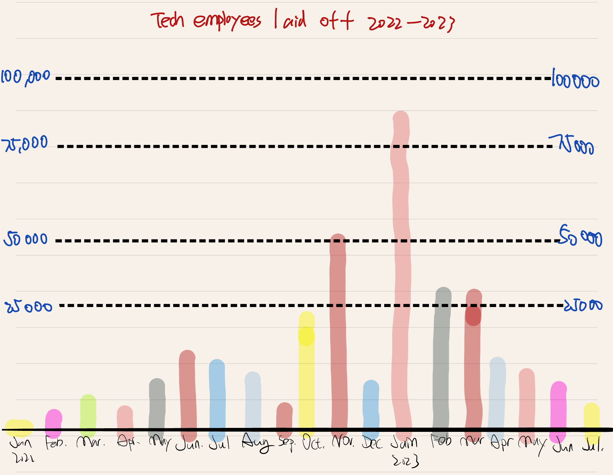
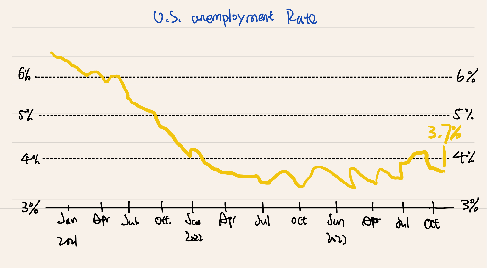
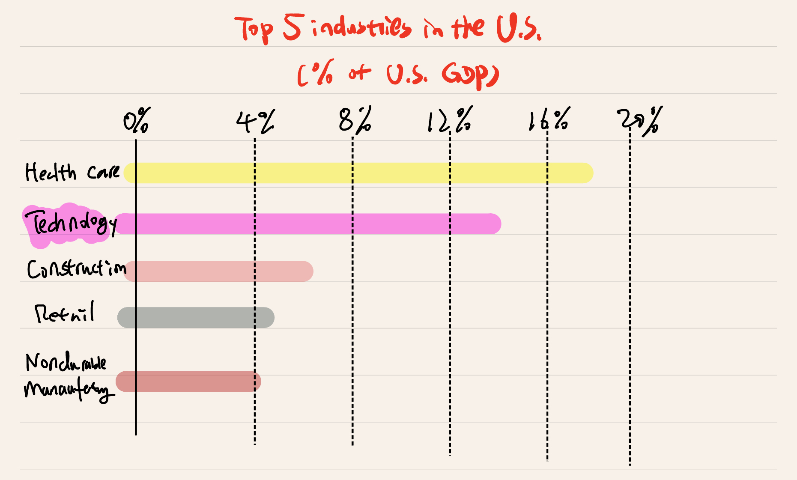
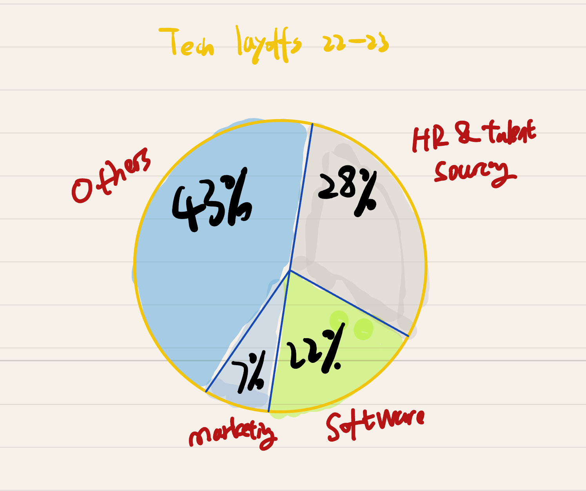

# Part II: Refining the Narrative and User Research

In Part II, I refined the story, developed wireframes, and conducted user research. This section provides a detailed breakdown of the wireframes and user research process, as well as feedback from interviews.

## 1. Narrative Structure and Outline

The overarching theme is to examine the impact of mass layoffs on tech workers and where these displaced employees find new opportunities. The story will follow a structured approach, emphasizing the shifting landscape of tech jobs and providing a clear call to action for tech students, recent graduates, and current employees. Below is the outline for the revised narrative:

### Wireframe 1: Tech Employee Layoffs Over Time
This wireframe displays the number of tech employees laid off from 2022 to mid-2023 using a bar graph. It highlights significant spikes in layoffs in early 2023.
- Source: Layoffs.fyi, as of July 2023

### Wireframe 2: U.S. Unemployment Rate vs Tech Layoffs
This wireframe juxtaposes the U.S. unemployment rate with tech layoffs, showing the contradiction between a generally low unemployment rate and the mass layoffs in tech.
- Source: U.S. Bureau of Labor Statistics Data as of February 2024

### Wireframe 3: Tech Industry Contribution to GDP
This wireframe illustrates the tech industry’s contribution to the U.S. GDP compared to other sectors. It uses a stacked bar chart to visualize the scale of tech’s economic impact.

### Wireframe 4: Impact of AI on Jobs
This wireframe represents the effect of AI on tech jobs, using a pie chart to break down roles affected by automation, restructuring, and other factors.

### Wireframe 5: Employee Growth of Meta and Alphabet
This wireframe compares the employee growth of Meta and Alphabet between 2019 and 2021, emphasizing the rapid hiring trends that led to overextension and eventual layoffs.

---

## 2. User Research and Interviews

### Target Audience
The target audience for this project includes:
- Tech professionals (entry-level and experienced)
- Tech major students and recent graduates
- General readers with an interest in the tech industry and AI

### Approach to Identifying Interviewees
Three interviewees were selected for user research:
1. A recent Tech graduate
2. A mid-career tech professional impacted by layoffs
3. A recruiter who works within the tech sector

### Interview Script
1. **General Perception**: What are your thoughts on the future of tech employment and its connection to AI and automation?
2. **Visual Impact**: Do the visualizations help communicate the story of tech growth and recent layoffs effectively?
3. **Clarity and Engagement**: How engaging and clear are the visualizations? How could they be improved?

### Findings from Interviews
- **Interviewee 1**: Found the charts engaging but suggested more explicit connections between AI job displacement and tech layoffs.
- **Interviewee 2**: Felt the story accurately portrayed the uncertainty in the industry but wanted more detail about recovery trends and opportunities.
- **Interviewee 3**: Suggested focusing more on the rapid skill shifts required by AI and automation, and the mismatch in hiring demands.

### Changes to Implement
- **AI Impact Expansion**: Include more detail about AI’s influence on specific job types.
- **Hiring Trends**: Emphasize shifts in skills required for new tech roles, particularly AI and data-related positions.
- **Recovery Opportunities**: Add insights on industries absorbing displaced tech workers and future job opportunities.

---

## 3. Optional: Moodboard and Personas

I created a moodboard with examples of similar visualizations focusing on tech and AI. Key colors include blue and yellow, representing both the stability of the tech sector and the warnings about the volatility of job security. Personas for recent CS graduates, laid-off workers, and tech recruiters were developed to ensure a targeted narrative.

---

**Next Steps**:
Implement feedback from interviews and proceed with the final visualizations and narrative development for Part III.

---
## Navigation
- [Back to Main Portfolio](README.md)

